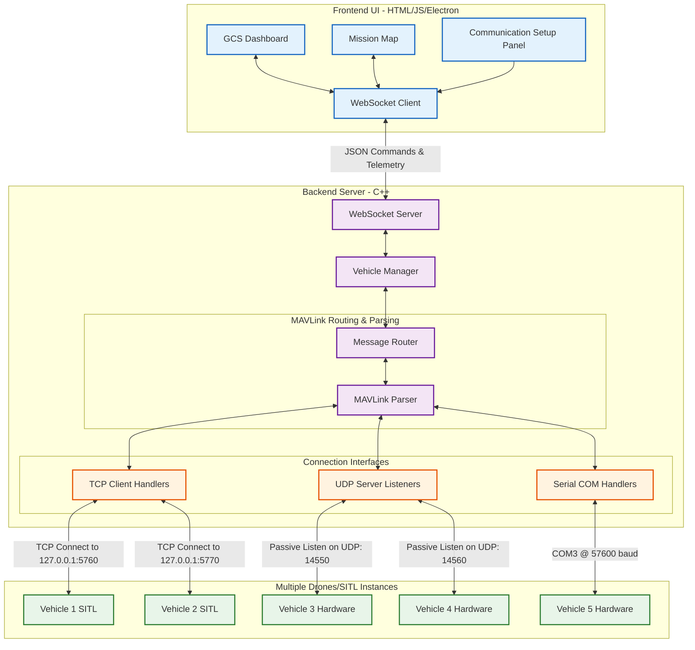
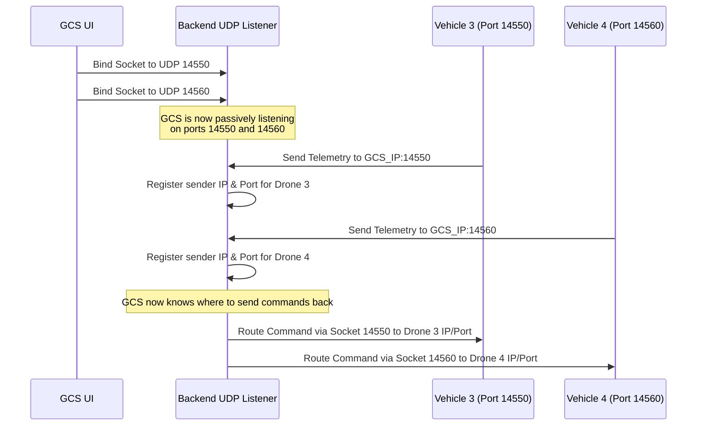

# TiHANFly GCS Multi-Vehicle Connection Architecture

This document outlines the architecture of how the TiHANFly Ground Control Station (GCS) connects to and manages multiple vehicles simultaneously using different communication protocols (TCP, UDP, and Serial), with a specific focus on UDP multi-port handling.

## System Architecture Diagram

---

## 1. How Vehicles are Connected (General)

The GCS acts as a central hub capable of spawning multiple distinct communication channels simultaneously. The backend (`VehicleManager` in C++) maintains a registry of active connections.

1. **Connection Request:** The user specifies a connection type (TCP, UDP, Serial) and target (IP:Port, Local Port, or COM Port) in the UI.
2. **Socket Initialization:** The backend spawns a dedicated socket or serial handler for that specific connection.
3. **MAVLink Parsing:** As bytes stream in from these interfaces, they are parsed into complete MAVLink messages (like `HEARTBEAT`).
4. **Vehicle Instantiation:** Upon receiving a valid MAVLink heartbeat on a new interface, the `VehicleManager` creates a distinct `Vehicle` instance in memory.
5. **UI Synchronization (ui_sysid):** To prevent collisions (e.g., when two SITL drones have the same internal MAVLink `sysid`), the backend assigns a unique `ui_sysid` tied to the specific connection channel. The frontend uses this `ui_sysid` to route commands to the correct drone.

---

## 2. Deep Dive: UDP Connections and Port Control

Unlike TCP (where the GCS actively connects to a drone's server) or Serial (where a direct physical link is established), UDP relies on datagrams and requires a slightly different approach for multi-vehicle control.

### How UDP Listening Works
In the TiHANFly GCS, the UDP interface is configured for **passive listening** on user-defined ports.

### Key Mechanisms for UDP Multi-Drone Control:

1. **Multiple Bindings:** Instead of a single UDP listener, the C++ backend opens a separate UDP socket bound to a distinct local port for each vehicle (e.g., Socket A on `14550`, Socket B on `14560`).
2. **Sender Identification (Endpoint Caching):** Because UDP is connectionless, the GCS initially only *listens*. When the drone starts transmitting telemetry to the GCS's port, the backend captures the **Sender IP and Source Port** from the incoming UDP packet header.
3. **Bidirectional Control:** Once the sender's endpoint is cached, the GCS uses that specific IP and port combination to send MAVLink command packets (like ARM, TAKEOFF, or Set Flight Mode) back through the same socket.
4. **Isolation:** Because Drone 1 communicates exclusively through the socket bound to `14550` and Drone 2 through `14560`, their data streams never collide. The `VehicleManager` maps Socket A strictly to Vehicle 1, ensuring commands triggered in the UI for Drone 1 are physically routed only to Socket A.
